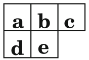

## Connected Component Labeling
Implementation of [Optimizing Two-Pass Connected-Component Labeling Algorithms](https://dl.acm.org/doi/10.1007/s10044-008-0109-y) by Kesheng Wu, Ekow Otoo, Kenji Suzuki

## Key notes
### Two Pass Scanning
Two pass scanning CCL usually includes:
- **Scanning phase**: In this phase, the image is scanned once to assign provisional labels to object pixels, and to record the equivalence information among provisional labels.
- **Analysis phase**: This phase analyzes the label equivalence information to determine the final labels.
- **Labeling phase**: This third phase assigns final labels to object pixels using a second pass through the image.

### Scanning Mask
Use a scanning mask of 4 elements. The forward pass performs left to right, top to bottom scan:



Where:
- `e` is the current pixel
- `a`, `b`, `c`, `d` are the neighbor pixels that need scanning. 

### New Scanning Decision Tree
They propose a new decision tree when travel neighbor pixels. This decision tree prevent the algorithm from scanning all 4 neighbors. There are some cases when we don't need to scan all 4 neighbors.


### New Union Find Algorithm for equivalent matching between labels

## Run
### Requirements
```[bash]
opencv-python
numpy
imutils
```

### Perform CCL and save image
```[bash]
python3 run.py --image_path images/ \
               --save_dir results/ \
               --run_pil
```

### Saving visualization for each step
```[bash]
python3 run.py --image_path images/example4.png \
               --save_dir results/ \
               --save_vis vis/ \
               --step 1
```
